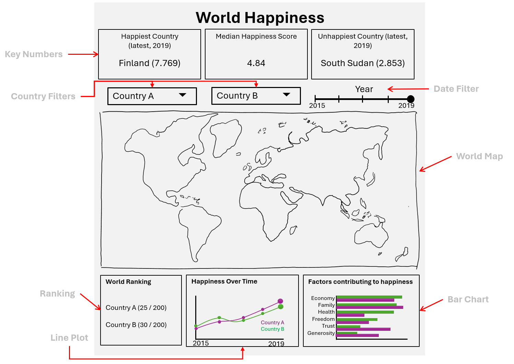

# Dashboard Proposal

## Section 1: Motivation and Purpose

Our Role: Developer of Teaching Tools

Target Audience: Educational Dashboard for Students  

Exploring various methods to learn about happiness in the world is commonplace within educational contexts, encompassing fields such as psychology, sociology, and economics. We inhabit a world where comprehending and comparing global happiness is increasingly significant. With the expanding divide between technology and conventional education, this dashboard seeks to bridge that gap by integrating technological tools into educational settings, thereby enhancing students understanding of happiness around the globe.  

The ability to visually interact with this dashboard enables students to see different countries' happiness scores, as well as the factors contributing to these specific scores, through a variety of filters. Students will also gain an understanding of how countries' happiness scores compare to the global average and how these scores have evolved over recent years.

## Section 2: Description of Data

For our visualization, we will use a dataset spanning from 2015 to 2019, comprising approximately 156 rows (countries) for each year. This brings the total to 782 rows. The dataset includes various columns that indicate a country's happiness ranking and score, as well as the factors contributing to this score. The columns that are to be used in this dashboard include:

1. `Country`: String values that will appear five times, once for each year, indicating the name of the country in the dataset.

2. `Overall rank` (also called `Happiness Rank` or `Happiness.Rank` in certain years): Integer values ranging from 1 to 158, representing the country’s happiness ranking globally. Each ranking will (typically) appear five times, as the countries are ranked once every year.

3. `Score` (also called `Happiness Score` or `Happiness.Score` in certain years): Continuous values that typically range between 7.8 and 2.8, with higher scores indicating greater happiness according to the data.  

4. The following columns (contributing factors to happiness): `GDP per capita` (also known as `Economy..GDP.per.Capita.` or `Economy (GDP per Capita)` in certain years), `Social support` (also known as `Family` in certain years), `Healthy life expectancy` (also known as `Health..Life.Expectancy.` or `Health (Life Expectancy)` in certain years), `Freedom to make life choices` (also known as `Freedom` in certain years), `Generosity`, and `Perceptions of corruption` (also known as `Trust..Government.Corruption.` or `Trust (Government Corruption)` in certain years) are continuous variables. They detail the extent to which these factors contribute to a country's happiness score. These variables can be interpreted as coefficients and range between 0 and 2.

Utilizing this data, we will create certain columns such as a `year` column and a normalized version of each contribution factor to happiness above to provide additional, more interpretable data points. This will aid in better understanding the impact of various factors on a country's Happiness Score.

## Section 3: Research Questions and Usage Scenarios

Geography and economy classes in high school are mostly preliminary. They do not touch on really sophisticated topics and are only there to build the foundation for any future learning. A simple tool displaying world happiness level can let students understand the distributions of happiness across the world, how some of the happiest and unhappiest countries differ, and also inspect some of the underlying factors that influence these levels.

Our target audiences are members of high school geography/economy classes (teachers and students). John is a high school student learning about geography. Using our tool, he is able to find the happiness level for each country/region across the world over time and compare two against each other in terms of their happiness level, ranking, and how some factors influence their levels such as economy, freedom, trust in government, etc.

Hypothetically, John finds that the economy factor contributes mostly to the happiness level, which likely makes sense considering that ultimately economy is the most major tie with quality of life for people around the world. He can then perhaps probe further into the economic models of the happiest and unhappiest countries in the world and see how they differ.

## Section 4: App sketch & brief description

The World Happiness Tracker App allows users to explore the Happiness Score of different countries. At the top of the page, the dashboard presents some global key numbers to the user. These numbers aim to give a user some reference points for the interpretation of further information. Below the key numbers block, the app presents the center piece of the app which is the world map that encodes the happiness score for each country with the help of a color scale. The default of the world map is to show the happiness scores for all countries for the most recent year. As the user chooses specific countries as Country A and Country B, as well as a particular year, the map greys out all the countries not selected by the user and only highlights the colors of the selected countries. The block below the map consists of three parts that allow more insights into the happiness of the selected countries. The ranking displays the rank of each of the selected countries out of all the countries. The line plot visualizes the happiness over time of the two countries A and B over the years and highlights the year selected. Finally, the bar chart breaks down the happiness score into its components and shows how much individual components contributed to the overall score.

